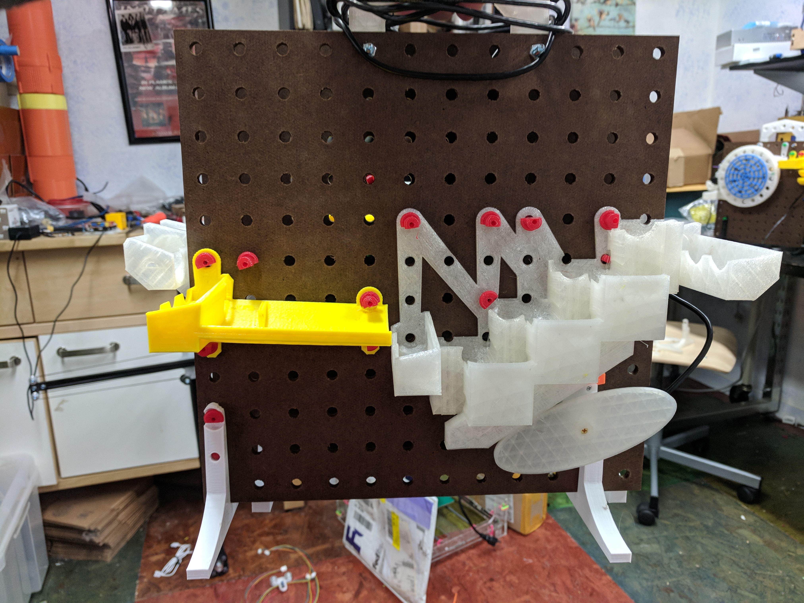

# Stair Lifter!

A marble machine module that uses a stair-step mechanism on a cam.  The actual lifter consists of three parts:
# Unique Parts
* sl_inlet.stl - The back set of stairs, doubles as the outlet.  Recommended print in PLA
* sl_stairs.stl - The front, moving set of stairs - rides up and down on the cam.  Again, recommend PLA for easy sliding.
* sl_cam.stl - Oval to lift and lower the stairs - attaches to the motor which is mounted on the sl_inlet.

The module is finished off with a wide slope to drop the ball bearings back down:
# Track
* wide_slope.stl - found in the [tracks](../tracks) folder

## Assembly
To complete the assembly, you'll need a bunch of printed pegs, feet, and one finishing style.

### Finishing
* Straight Clamps - connect to module left and right
* Dowel Returns - recirculate balls back to ourselves
* 180 degree - link two modules
* 90 degree - turn the corner

## Double Module
marble enters in at mid-height, exits the same height.  Requires another similar module and two ball_return_180.stl from the [parts](../parts) folder.

 Uniques
* sl_inlet.stl - The back set of stairs, doubles as the outlet.  Recommended print in PLA
* sl_stairs.stl - The front, moving set of stairs - rides up and down on the cam.  Again, recommend PLA for easy sliding.
* sl_cam.stl - Oval to lift and lower the stairs - attaches to the motor which is mounted on the sl_inlet.

### Tracks
* wide_slope.stl - found in the [tracks](../tracks) folder

### Standard Parts
* 2 stand.stl - and note that the feet are on columns 2 and 12, counting from 1 to 12, i.e. we skip the first column.  Also, the longer part of the foot is to the front of the module.
* 13 peg_tpu.stl - printed in TPU, or use the PETG files printed in PETG.
  * 4 for the legs, 4 for the wide slope, 5-ish for the stair inlet.

### Vitamins
* 12"x12" square of 1/4" pegboard
* 2 M3x12mm flat-head screws - to attach the motor
* 1 #3 by 3/8" flat-head wood screws - to attach the sl_cam.stl to the motor shaft
* 1 [Pololu Plastic Gearmotor](https://www.pololu.com/product/1120)
* USB charger/cable/5v supply
  * Note that the motor can turn in either direction in this module.

## Linking Double Modules
To link two standard double modules, double the parts above or use a different module, and add: 

## Parts
* 2 ball_return_180.stl - turn the balls around at the ends
* 6 peg_tpu.stl - to hold the ball returns on
* 1 double_handle.stl - to rigidly affix the two pegboards to eachother
* 2 M5x60mm screws - attach the handle
* 2 M5 nuts
* 4 M5 washers

